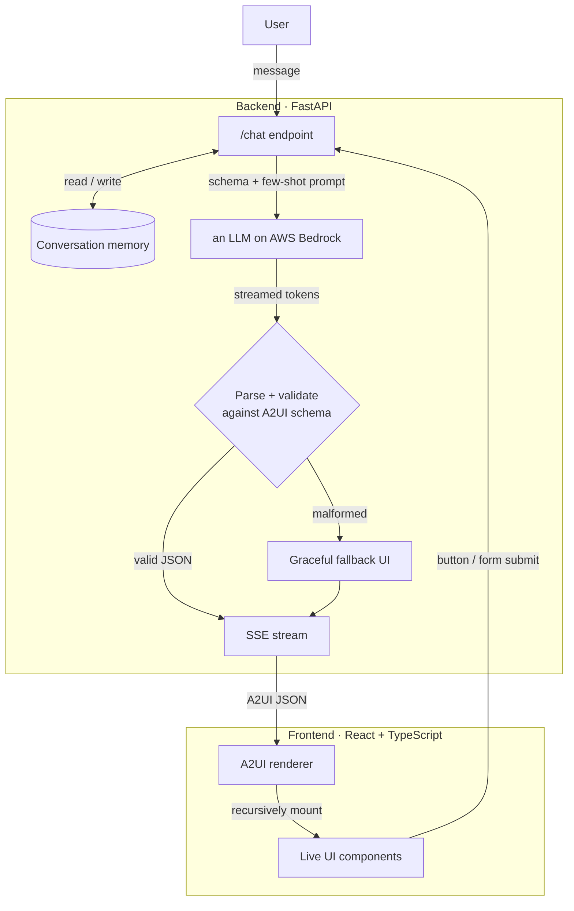

# A2UI Financial Advisor

> An LLM agent that turns natural-language finance questions into **live, interactive UI** — not walls of text. The agent decides what interface the user needs, emits it as schema-validated JSON, streams it over SSE, and a React/TypeScript renderer mounts it as real components.

Built with **an LLM on AWS Bedrock**, **FastAPI**, and **React + TypeScript**.

---

## The problem this explores

Chat interfaces answer almost everything with prose. But a lot of what people actually want isn't a paragraph — it's a *thing they can look at or interact with*: a side-by-side comparison, a form to fill, a breakdown of numbers. Forcing those through plain text makes the model wordier and the product worse.

**A2UI (Agent-to-UI)** flips that. Instead of returning text, the agent returns a structured JSON description of a user interface. The model chooses the right component for the moment — a comparison card, a preference form, a summary — and the frontend renders it as native UI. The result feels less like a chatbot and more like a product that assembles itself around each request.

This project applies that idea to a financial-advisory assistant.

## What it does

Three end-to-end flows, all driven by the model — no hardcoded responses, no mocked data:

1. **Data display** — *"Compare RELIANCE and TCS"* → the agent returns a styled comparison card with key metrics side by side.
2. **Form interaction** — *"Help me rebalance my portfolio"* → the agent returns a clean preference form the user fills and submits.
3. **Personalised summary** — on form submit, the agent reads the typed payload (plus prior conversation) and returns a tailored allocation-breakdown card.

Because the agent keeps conversation memory, later turns are personalised to earlier ones.

## Architecture


**The core idea:** the LLM's output is never trusted blindly. Every response is parsed and validated against a strict schema on the server *before* it reaches the browser. A malformed or hallucinated component fails in Python, and the user gets a graceful fallback — the frontend can never be handed broken UI.

### Components

| Layer | Responsibility |
| --- | --- |
| **FastAPI backend** | Accepts messages, builds the prompt, calls Bedrock, streams the result over Server-Sent Events. |
| **A2UI schema** | A Pydantic *discriminated union* (keyed on `type`) with recursive children. This is the contract between model and renderer, and the validation gate. |
| **Bedrock LLM layer** | Wraps the Converse streaming API; model-agnostic, swap the model ID via env. |
| **Validation + fallback** | Extracts JSON from model output, validates it, substitutes a safe fallback component on failure. |
| **Conversation memory** | Per-session history so the agent can personalise across turns. |
| **React renderer** | Recursively maps A2UI nodes to typed components, manages controlled form state, and sends typed payloads back on interaction. |

## A2UI: the component protocol

The agent composes UIs from a small, recursive set of primitives:

- `container` — layout wrapper (row/column, gap) with children
- `card` — titled surface with children
- `text` — typed text (heading / body / metric / caption …)
- `button` — label + an action the frontend sends back on click
- `text-field` — a controlled input that contributes to a form payload
- `form` — groups fields and emits a typed payload on submit

Every node is `{ type, props, children? }`. Because `children` is itself a list of nodes, arbitrarily nested UIs compose from these few types.

## Prompt design

A few deliberate choices keep model output reliable enough to render:

- **Schema in the prompt.** The system prompt describes the exact JSON contract, so the model generates against a known shape instead of inventing one.
- **Few-shot examples.** One worked example per flow (comparison, form, summary) anchors both structure *and* visual quality.
- **JSON-only output.** The model is instructed to return a single JSON object and nothing else, which makes extraction and validation deterministic.
- **Validation as a safety net, not a hope.** The schema — not the prompt — is the real guarantee. Anything that doesn't validate becomes a fallback, so a bad generation degrades instead of breaking.

## Tech stack

**Backend:** Python, FastAPI, Pydantic v2, boto3 (AWS Bedrock Converse API), Server-Sent Events
**Frontend:** React 18, TypeScript, Vite
**Model:** any Bedrock-hosted foundation model (configurable via env)

## Getting started

### Backend
```bash
cd backend
python -m venv .venv && source .venv/bin/activate
pip install -r requirements.txt
cp .env.example .env          # set your AWS region + Bedrock model id
uvicorn app.main:app --reload
```

The service reads AWS credentials from the standard chain (env vars, `~/.aws/credentials`, or an IAM role). You need Bedrock **model access** enabled for your chosen model in that region.

### Frontend
```bash
cd frontend
npm install
npm run dev
```

## Project structure
```
A2UI-Financial-Advisor/
├── backend/
│   ├── app/
│   │   ├── schema.py        # A2UI Pydantic schema (the contract)
│   │   ├── prompts.py       # system prompt + few-shot examples
│   │   ├── llm.py           # Bedrock Converse streaming client
│   │   ├── validation.py    # parse + validate + fallback
│   │   ├── memory.py        # per-session conversation store
│   │   └── main.py          # FastAPI app + SSE endpoint
│   ├── requirements.txt
│   └── .env.example
├── frontend/                # React + TypeScript renderer
└── README.md
```

## Roadmap

- Validator + retry loop — a second model pass checks the A2UI JSON and feeds errors back for one retry before falling back.
- Richer components — `select`, `data-table`, `badge`, inline charts.
- Tool calling — live stock prices / market data folded into the generated UI.
- Redis-backed memory for horizontal scale.
- Partial-JSON streaming so the UI paints as the component arrives, not just after.

