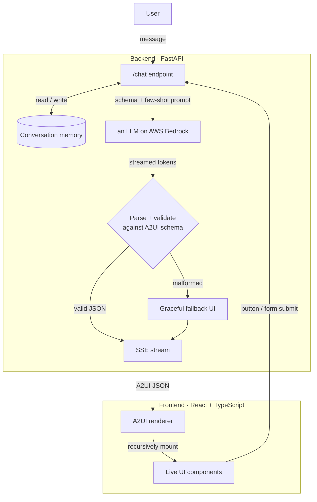

# A2UI Financial Advisor

> An LLM agent that turns natural-language finance questions into **live, interactive UI** — not walls of text. The agent decides what interface the user needs, emits it as schema-validated JSON, streams it over SSE, and a React/TypeScript renderer mounts it as real components.

Built with **an LLM on AWS Bedrock**, **FastAPI**, and **React + TypeScript**.

---

## The problem this explores

Chat interfaces answer almost everything with prose. But a lot of what people actually want isn't a paragraph — it's a *thing they can look at or interact with*: a side-by-side comparison, a form to fill, a breakdown of numbers. Forcing those through plain text makes the model wordier and the product worse.

**A2UI (Agent-to-UI)** flips that. Instead of returning text, the agent returns a structured JSON description of a user interface. The model chooses the right component for the moment — a comparison card, a preference form, a summary — and the frontend renders it as native UI. The result feels less like a chatbot and more like a product that assembles itself around each request.

This project applies that idea to a financial-advisory assistant.

## What it does

Three end-to-end flows, all driven by the model — no hardcoded responses, no mocked data:

1. **Data display** — *"Compare RELIANCE and TCS"* → the agent returns a styled comparison card with key metrics side by side.
2. **Form interaction** — *"Help me rebalance my portfolio"* → the agent returns a clean preference form the user fills and submits.
3. **Personalised summary** — on form submit, the agent reads the typed payload (plus prior conversation) and returns a tailored allocation-breakdown card.

Because the agent keeps conversation memory, later turns are personalised to earlier ones.

## Architecture


**The core idea:** the LLM's output is never trusted blindly. Every response is parsed and validated against a strict schema on the server *before* it reaches the browser. A malformed or hallucinated component fails in Python, and the user gets a graceful fallback — the frontend can never be handed broken UI.

### Components

| Layer | Responsibility |
| --- | --- |
| **FastAPI backend** | Accepts messages, builds the prompt, calls Bedrock, streams the result over Server-Sent Events. |
| **A2UI schema** | A Pydantic *discriminated union* (keyed on `type`) with recursive children. This is the contract between model and renderer, and the validation gate. |
| **Bedrock LLM layer** | Wraps the Converse streaming API; model-agnostic, swap the model ID via env. |
| **Validation + fallback** | Extracts JSON from model output, validates it, substitutes a safe fallback component on failure. |
| **Conversation memory** | Per-session history so the agent can personalise across turns. |
| **React renderer** | Recursively maps A2UI nodes to typed components, manages controlled form state, and sends typed payloads back on interaction. |

## A2UI: the component protocol

The agent composes UIs from a small, recursive set of primitives:

- `container` — layout wrapper (row/column, gap) with children
- `card` — titled surface with children
- `text` — typed text (heading / body / metric / caption …)
- `button` — label + an action the frontend sends back on click
- `text-field` — a controlled input that contributes to a form payload
- `form` — groups fields and emits a typed payload on submit

Every node is `{ type, props, children? }`. Because `children` is itself a list of nodes, arbitrarily nested UIs compose from these few types.

## Prompt design

Technique names follow the [Prompt Engineering Guide](https://www.promptingguide.ai/techniques).

- **Contract-first.** The system prompt embeds the exact A2UI JSON schema — every
  component type, its props, and enum values — so the model generates against a
  known shape instead of inventing one.

- **Few-shot prompting.** One `user message → A2UI JSON` example per flow
  (comparison card, preference form, allocation summary) anchors both valid
  structure and visual quality.

- **The model decides the component.** The prompt frames the job as "choose the
  right interface" (compare → card, needs input → form, has the user's data →
  summary). The intent→UI mapping lives in the model, not hardcoded Python.

- **JSON-only output.** One JSON object, no prose or markdown fences —
  deterministic output for deterministic parsing.

- **The prompt hints; the schema guarantees.** Output is validated server-side
  against the Pydantic schema; anything that fails becomes a graceful fallback.

**Techniques used elsewhere:** prompt chaining for the multi-agent pipeline
(Intent → Data → UI Generator), and ReAct for the tool-calling path
(reason → act → observe → respond).

## Tech stack

**Backend:** Python, FastAPI, Pydantic v2, boto3 (AWS Bedrock Converse API), yfinance, Server-Sent Events
**Frontend:** React 18, TypeScript, Vite, Tailwind CSS v4
**Model:** any Bedrock-hosted foundation model (configurable via env)

## Getting started

### Backend
```bash
cd backend
python -m venv .venv && source .venv/bin/activate
pip install -r requirements.txt
cp .env.example .env          # set your AWS region + Bedrock model id
uvicorn app.main:app --reload
```

The service reads AWS credentials from the standard chain (env vars, `~/.aws/credentials`, or an IAM role). You need Bedrock **model access** enabled for your chosen model in that region.

### Frontend
```bash
cd frontend
npm install
npm run dev
```

## Project structure
```
A2UI-Financial-Advisor/
├── backend/
│   ├── app/
│   │   ├── schema.py        # A2UI Pydantic schema (the contract)
│   │   ├── prompts.py       # system prompt + few-shot examples
│   │   ├── llm.py           # Bedrock Converse streaming client
│   │   ├── validation.py    # parse + validate + fallback
│   │   ├── memory.py        # per-session conversation store
│   │   ├── tools.py         # yfinance tool-calling (real market data)
│   │   └── main.py          # FastAPI app + SSE endpoint
│   ├── requirements.txt
│   └── .env.example
├── frontend/
│   ├── src/
│   │   ├── a2ui/
│   │   │   ├── types.ts       # TS mirror of schema.py
│   │   │   ├── Renderer.tsx   # recursive A2UI renderer
│   │   │   └── FormContext.tsx
│   │   ├── components/        # Text, Button, TextField, Container, Card, Form
│   │   ├── api/
│   │   │   └── chat.ts        # SSE-over-fetch client
│   │   └── App.tsx            # chat shell
│   └── package.json
└── README.md
```

## Status

**Full stack — done and verified end-to-end**, including a live frontend and
real market data (no mocks, no hardcoded responses anywhere):

| Flow | Input | Output | Status |
| --- | --- | --- | --- |
| Data display | "Compare RELIANCE and TCS" | comparison `card`, real yfinance data | Done |
| Form interaction | "invest ₹50,000" | preference `form` (prefilled) | Done |
| Personalised summary | submitted form payload | tailored allocation `card` | Done |

Underneath: the model **chooses** the component per intent, conversation
**memory** carries context across turns, malformed model output **falls back**
to a safe component instead of reaching the browser, and comparison requests
are backed by **real market data** rather than model-invented figures.

**Backend:**
- `schema.py` — A2UI contract (discriminated union, recursive)
- `prompts.py` — system prompt + few-shot examples
- `llm.py` — Bedrock Converse streaming client
- `validation.py` — parse + validate + graceful fallback (the trust boundary)
- `memory.py` — per-session conversation store
- `tools.py` — yfinance tool-calling: real market cap / P/E / sector, ReAct
  pattern (detect tickers -> fetch -> inject into prompt), fails soft
- `main.py` — FastAPI SSE `/chat` endpoint wiring the full turn, including
  the tool-calling step

**Frontend:**
- `a2ui/types.ts` — TypeScript mirror of `schema.py`, no `any` on core types
- `a2ui/Renderer.tsx` — one recursive component rendering all 6 A2UI types
- `a2ui/FormContext.tsx` — shares form state with nested `text-field`s at any
  depth, so a `form` doesn't need its fields to be direct children
- `components/` — Text, Button, TextField, Container, Card, Form
- `api/chat.ts` — SSE-over-fetch client (`EventSource` is GET-only; `/chat`
  is POST, so this reads the stream manually via `ReadableStream`)
- `App.tsx` — chat shell with persistent message history, real session id,
  button/form actions looped back into `/chat` as the next turn

## Roadmap

- Validator + retry loop — a second model pass checks the A2UI JSON and feeds errors back for one retry before falling back.
- Richer components — `select`, `data-table`, `badge`, inline charts.
- Redis-backed memory for horizontal scale.
- Partial-JSON streaming so the UI paints as the component arrives, not just
  after the full response is collected — the current build deliberately
  collects the full stream server-side and validates before emitting one
  clean event; this is the planned next step past that.